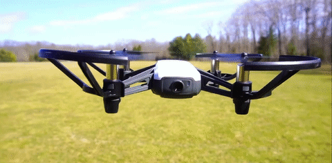

# Tello Drone Controller Web App

This is a web application for controlling a Tello drone. It provides a user-friendly interface for sending commands to the drone and streaming video from it.



## Features

- **Remote Controller**: Control the Tello drone remotely through a web browser.
- **API Commands**: Send commands to the drone via a RESTful API.
- **Video Streaming**: Stream live video from the drone's camera.
- **Responsive Design**: The web interface is optimized for various screen sizes, including desktop and mobile devices.

## Prerequisites
Before getting started, make sure you have the following:

- Go (version 1.21.4) installed on your system
- [Tello drone](https://store.dji.com/product/tello)
- Web browser

## Installation

1. Clone the repository:

   ```bash
   git clone https://github.com/namashin/go-tello.git

# Go Tello Drone Controller

Follow these steps to build, run, configure, and use the Go Tello Drone Controller:

## Installation

# Navigate to the project directory
```bash
cd go-tello
go mod tidy
```
# Build the project
```bash
go build
```
# Run the application
```bash
./go-tello
```
## Configuration

The application can be configured via the `config.ini` file located in the root directory. Modify the configuration parameters as needed.

## Usage

1. Connect your Tello drone to the same network as your computer.
2. Open the web interface in your browser.
3. Use the buttons and sliders to control the drone.
4. Enjoy flying your Tello drone!

## Contributing

Contributions are welcome! Please feel free to submit issues or pull requests.

## PDF Manual

For detailed instructions on usage and configuration, refer to the attached PDF.
- [Tello SDK 2.0 User Guide](https://github.com/namashin/go-tello/blob/master/Tello%20SDK%202.0%20User%20Guide.pdf).

